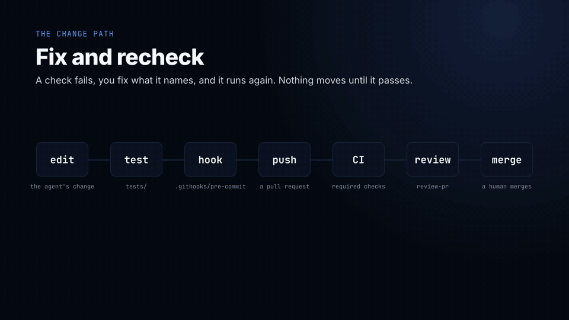
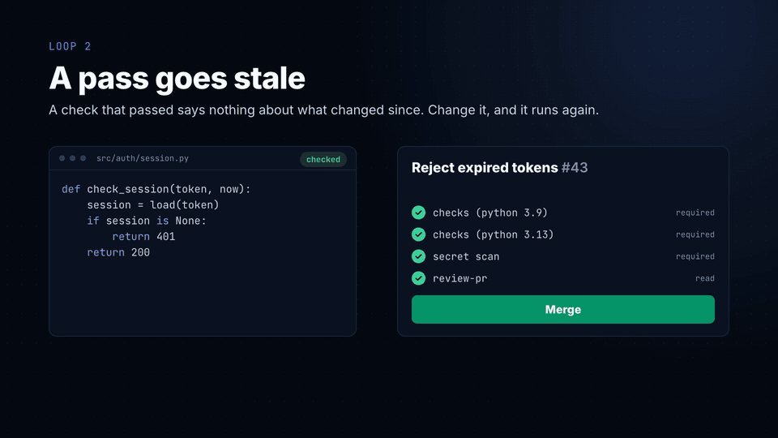
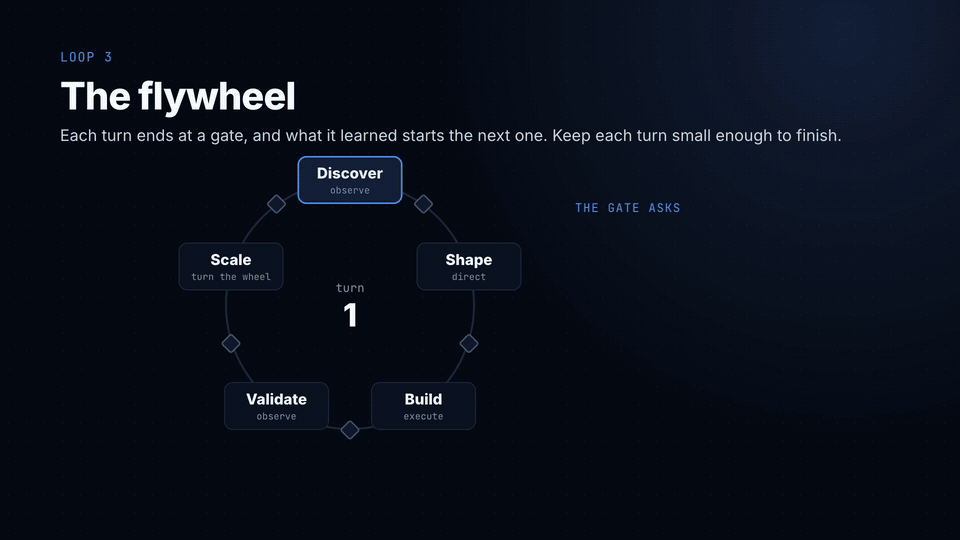
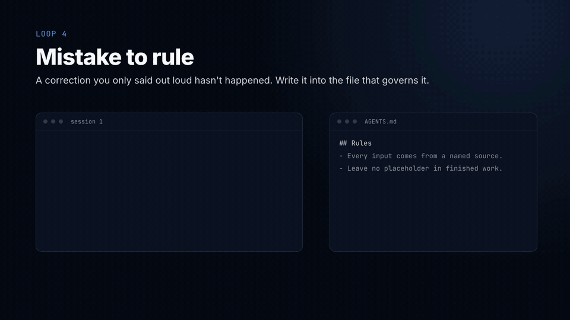

# Harness starter

Built and maintained by [Sanvio Labs](https://sanviolabs.com). Free under MIT.

A harness is everything around the model: the rules it reads, the procedures it
follows, the checks that stop it, and the other agents it hands work to. The
model is the engine. The harness is what makes it safe to leave running.


This repo is the smallest harness that still does the job. The root is
generic: rules, skills, a reviewer, the checks, and a place for your company
and your code. One worked job sits in [`examples/proposal/`](examples/proposal/), drafting client
proposals, because a proposal is where the cheap mistakes live: a placeholder
left in, a rate somebody made up, a total that doesn't add up. None of those are
hard. All of them ship anyway when the process lives in your head. You read
the example, then build your own job the same way at the root.

It works with Claude Code, Codex and Kiro. Nothing in it is tied to one tool.

## Set up

```bash
git clone <this repo> my-harness && cd my-harness
git config core.hooksPath .githooks
python3 scripts/check_setup.py
```

**Don't skip the middle line.** Git won't run the hook in [`.githooks/`](.githooks/) unless
you point it there, and the setting doesn't travel with a clone. Skip it and
every check in the hook silently does nothing. That exact line was missing from
a real harness for months, and nobody noticed because nothing failed.

You need Python 3.9 or newer and no packages.

In Claude Code, start it from the repo's root and say yes when it asks
whether you trust the folder. A line then sits above the prompt:

```
◆ harness  steering: 3 always on  skill: none yet  gate: none run  guard: no refusals  review: none yet
```

That's the harness lens. It names each layer as it acts on your session, and
`/lens` lists everything it did. No line? Your Claude Code may be older than
the version it was tested on (2.1.295), or the folder isn't trusted.
[`examples/mods/harness-lens/`](examples/mods/harness-lens/) has the two commands that install it from inside a
session. Codex and Kiro don't show it: neither has mods.

Working through this on your own? Open the repo in your agent and run
`/orientation` in Claude Code, or say "get me started" in any of them.
[`skills/orientation/`](skills/orientation/) checks your setup, asks where your company's data lives
and how the agent should reach it, then walks you through the five layers
around your own job.

Copied it a while ago? Ask your agent "what's new", or run `/whats-new` in
Claude Code. It compares your [`CHANGELOG.md`](CHANGELOG.md) with this repo's and tells you
what you don't have yet and what to do to take it.

`python3 scripts/check_setup.py` runs the setup check on its own: Python, the
hook, the links below, and whether `origin` is still this public repo. Make
your own private copy before any company material goes in.

On Windows, clone with `git clone -c core.symlinks=true` from a terminal with
Developer Mode on, or the two links below arrive as plain text files. If they
do, [`AGENTS.md`](AGENTS.md) still works for every tool.

## The five layers, one step at a time

Each step is a tag. Check one out to see the harness as it stood at that point,
or diff two to see exactly what a layer adds.

| Tag | Adds | What it fixes |
|---|---|---|
| `step-0` | A rate card, a template, one finished proposal | Nothing yet. The agent guesses |
| `step-1` | [`AGENTS.md`](AGENTS.md), the instructions file | The agent stops inventing rates and knows where things go |
| `step-2` | `skills/draft-proposal/`, a skill | Drafting becomes the same procedure every time, with a defined output |
| `step-3` | `gates/proposal_gate.py`, a gate | "Done" becomes something a script checks, not something the agent claims |
| `step-4` | [`.githooks/pre-commit`](.githooks/pre-commit), a hook | The gate runs whether anyone remembers it or not, and secrets can't be committed |
| `step-5` | `agents/proposal-reviewer.md`, a review agent | A second reader who reads like the client, and reports without editing |

```bash
git checkout step-2          # the harness after step 2
git diff step-2 step-3       # what the gate adds
git checkout main            # everything
```

The tags build the proposal job at the root, one layer at a time, which is
how the talk builds it. On `main` the same files live in [`examples/proposal/`](examples/proposal/),
the reviewer is generic ([`agents/reviewer.md`](agents/reviewer.md), with the proposal brief in the
example), and the root is left for your own job. Check out `step-0` to start
where the talk started.

## One file, three tools

Each tool reads its instructions from a different place. So there's one real
file and the others point at it:

| Tool | Reads | Here |
|---|---|---|
| Codex | [`AGENTS.md`](AGENTS.md) | The real file |
| Claude Code | [`CLAUDE.md`](CLAUDE.md) | `@AGENTS.md`, plus one warning for a session started in the wrong folder |
| Kiro | [`.kiro/steering/`](.kiro/steering/) | Symlinks to [`AGENTS.md`](AGENTS.md) and the steering files it loads every session |

Skills and agents work the same way: the real file lives in [`skills/`](skills/) or
[`agents/`](agents/), and [`AGENTS.md`](AGENTS.md) names it so every tool can find it. Claude Code also
picks them up natively through [`.claude/`](.claude/).

A second copy of an instruction is worse than none. It drifts, and it still
reads as the rule.

## Rules versus enforcement

[`AGENTS.md`](AGENTS.md) is context. The agent reads it and usually follows it. The hook is
enforcement. It runs whatever the agent decided. Anything you'd hate to get
wrong belongs in the second one.

Here's which is which, in the order a session meets them:


## Beyond the five layers

Each piece below is the small version of something a working harness runs on
every day.

| Piece | Where | What it does |
|---|---|---|
| Steering | [`steering/`](steering/) | Standing guidance, one topic per file: how the agent operates and replies, what data may go to which tool, writing, new-project setup, building and testing, deploying, gates, and model choice. Three load every session; the rest when their moment comes. Light versions of what a working harness runs on, to edit into yours |
| A company record | [`company/`](company/) | Who the agent works for: what you sell, how you sound, what you won't do, and where your data lives. `/orientation` interviews you for it. Gitignored, so it never reaches a public repo by accident |
| Guards inside the agent | [`.claude/settings.json`](.claude/settings.json), [`.claude/hooks/`](.claude/hooks/) | Claude Code runs `guard.py` before every tool call: it refuses credential files and asks you before any connector tool whose name says it sends, edits, deletes or shares. A session-start check says out loud when the git hook is off |
| Your repos, inside it | [`projects/`](projects/) | Clone your code repos here and start the agent from the harness root, so every repo works under the same rules, skills and guards. [`projects/README.md`](projects/README.md) has the catch we measured: start inside a project and the hooks and skills don't load |
| Review skills | [`skills/review-pr/`](skills/review-pr/), [`skills/review-tests/`](skills/review-tests/) | A PR review that runs the tests and ranks findings by cost, and a test review that breaks the code on purpose, in a scratch copy, to see which tests notice |
| A way to learn | [`skills/learn/`](skills/learn/) | Say "learn from that" after the agent gets something wrong, and it writes the rule into the file that governs it, dated, with the reason |
| A release log | [`CHANGELOG.md`](CHANGELOG.md), [`skills/whats-new/`](skills/whats-new/) | Ask "what's new" and the agent reads the log, compares it with the starter's, and says what you don't have yet and what to do to take it. Changes to your own harness go in the same file |
| A usage log and sprint report | [`.claude/hooks/usage_log.py`](.claude/hooks/usage_log.py), [`skills/harness-report/`](skills/harness-report/) | Each person's sessions log which skills, agents and commands ran and when the guard refused or asked: names and counts, never content, kept on their own machine. At sprint end `harness-report` turns it into a short report with their proposals, shared as a PR, so whoever owns the harness sees what the team actually uses and what to add. `HARNESS_USAGE_LOG=off` turns it off for you |
| An optional extra: a loop that runs without you | [`scripts/loop.py`](scripts/loop.py) | Not one of the five layers, and the harness works without it. Takes the next open issue labelled `loop-ready`, has a fresh agent plan it, build it in a worktree, runs your tests itself, has a second fresh agent review the diff, and opens a pull request when both pass. It follows the flywheel (Discover, Shape, Build, Validate, Scale), writes one plain log you read with `tail -f .loop/loop.log`, and never merges. Label only issues you wrote or have read, since a ticket is an instruction to an agent. One standard-library file, so it's yours to change. [`HOW-IT-WORKS.md`](HOW-IT-WORKS.md) has the shape |
| CI | [`.github/workflows/`](.github/workflows/) | The tests, the gate, the setup check and a secret scan of the whole history run on every push, so a check someone skipped locally still runs before anything merges. Make it a required check in your branch protection, or it only reports |

[`HOW-IT-WORKS.md`](HOW-IT-WORKS.md) explains what's running underneath: where the loops are, how
context is kept separate, and how little of it is code.

The in-agent guards are Claude Code only. Codex and Kiro have their own hook
systems; the git hook is the check all three share.

**Where something new goes.** A rule, a fact about your company, a check:
each has one home, and a second copy drifts. [`skills/learn/`](skills/learn/) picks the home
in this order, starting with the places the agent can't skip, and stops at the
first that fits.


## Four loops that keep it working

The layers are what a harness is made of. The loops are how you run it. Each
one is small, and each one is the difference between a harness that works on
day one and a harness that still works in month six.

**1. Fix and recheck.** A check fails, you fix what it names, it runs again,
and nothing moves until it passes. Here that's the skill's last two steps and
the hook refusing a commit. The rule that makes it a loop: never edit the check
to make the work pass.



**2. A pass goes stale.** A check that passed yesterday says nothing about the
file you edited this morning. That's why the gate runs in the hook on every
commit, not once when someone remembers. In your job, anything that was
reviewed and then changed gets reviewed again.



**3. The flywheel.** Every stage ends at a gate, and the output of one turn is
the input to the next. A proposal becomes a signed scope, the scope becomes the
build, and the build's lessons change the next proposal. Keep each turn small
enough to finish.



**4. Mistake to rule.** When the agent gets something wrong, don't just fix the
output. Write the rule that stops it happening again, in the file that governs
it: [`AGENTS.md`](AGENTS.md), a skill, or a gate if it has to hold. Mitchell Hashimoto calls
this harness engineering. A correction you only said out loud hasn't happened,
because the next session never heard it.



The fourth loop is the one that makes the others better. Every other file in
this repo exists because of it.

## Borrowing other people's skills

Other people's skills are the fastest way to get better. Matt Pocock's and Jesse
Vincent's collections below are full of procedures you'd take months to arrive
at on your own. Use them.

Carefully, though. A skill is instructions your agent follows with your
permissions, and the registries have no review. In February 2026, Snyk scanned
3,984 public skills and found 13.4% with a critical issue: malware, prompt
injection, exposed secrets.

So don't install a skill. Have your harness review it:

```text
review the skill at https://github.com/<someone>/<skills>/tree/main/<skill>
```

[`skills/review-skill/`](skills/review-skill/) quarantines it in `incoming/`, reads every file, flags
anything that reaches for credentials or tells the agent to skip your rules,
then compares it with what you already have. You adopt only the gaps, rewritten
in your own conventions, with the source and licence noted. Your harness stays
yours, and it gets better every time you read someone else's.

When you want more than this starter carries,
[Stelliad](https://github.com/Stelliad/stelliad-skills) has 28 open skills
built the same way: each one ends in a verdict backed by evidence, and ships a
`CUSTOMIZE.md` so you adapt it rather than install it as-is. The full
`review-skill`, `run-gates` and `review-ticket` live there. Review them like
anyone else's.

## People to follow

- **Mitchell Hashimoto** named harness engineering: every agent mistake becomes
  a permanent fix in its environment. Start with
  [My AI Adoption Journey](https://mitchellh.com/writing/my-ai-adoption-journey).
- **Matt Pocock** publishes his own skills, including a TDD skill that won't let
  the agent write code before a failing test:
  [mattpocock/skills](https://github.com/mattpocock/skills).
- **Jesse Vincent** built Superpowers, a whole method as skills: brainstorm,
  plan, test, review: [obra/superpowers](https://github.com/obra/superpowers).
- **Geoffrey Huntley** runs the same prompt in a loop with fresh context and
  lets the files carry the state:
  [everything is a ralph loop](https://ghuntley.com/loop/).
- **Dex Horthy** wrote the principles for agents that hold up in production:
  [12-factor agents](https://github.com/humanlayer/12-factor-agents).
- **Simon Willison** writes up what actually works, week by week, with the
  receipts: [simonwillison.net](https://simonwillison.net/).

## Your turn

[`EXERCISES.md`](EXERCISES.md) has the hands-on: pick a job you actually do, and build the
same five layers around it that [`examples/proposal/`](examples/proposal/) has.

In Claude Code, the line above the prompt names each layer as it acts, so you
can watch yours work. It's on by default. [`examples/mods/harness-lens/`](examples/mods/harness-lens/)
has how to read it.

## Licence and credit

MIT. Take it, change it, ship it. See [`LICENSE`](LICENSE).

The licence asks one thing: keep the copyright notice. I'm asking one more.
If you build on this, keep the line that says where a file came from, and
link back here when you write about it. GitHub's "Cite this repository"
button gives you the wording ([`CITATION.cff`](CITATION.cff)).

Tell me what you built. I'd like to see it.

## Who made this

[Sanvio Labs](https://sanviolabs.com). I build AI products from idea to
production, and I build harnesses like this one inside engineering teams that
already have coding agents and want a method around them. If that's your
team, write to [contact@sanviolabs.com](mailto:contact@sanviolabs.com).
